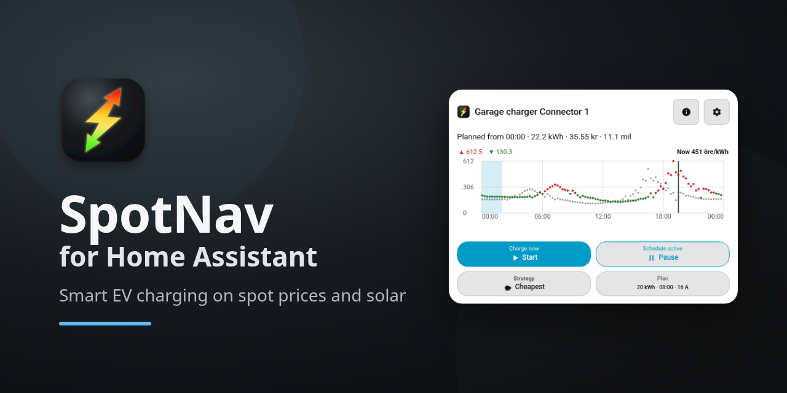

[](https://my.home-assistant.io/redirect/hacs_repository/?owner=henrikekblad&repository=spotnav-home-assistant&category=integration)

SpotNav plans and runs your EV charging inside Home Assistant. It reads spot prices from the
public SpotNav Relay (no account or API key) and follows them.

- **Charges when power is cheapest.** It picks the cheapest hours before your departure, or a
  target state of charge, and starts and stops your charger to follow the plan.
- **Uses your sun and respects your fuse.** It can charge from solar surplus, hold back grid energy
  when a solar forecast promises sun, and keep several chargers under one main fuse.
- **Runs locally.** The plan lives in Home Assistant and keeps running if your phone is away. A
  Lovelace card is included, and the SpotNav Android app
  ([Google Play](https://play.google.com/store/apps/details?id=se.sensnology.spotnav),
  [GitHub](https://github.com/henrikekblad/spotnav)) pairs with it.

## Requirements

- Home Assistant 2026.9 or newer, with [HACS](https://hacs.xyz) installed.
- A charger that Home Assistant can switch on and off: one of the
  [supported integrations](docs/supported.md) (OCPP, Easee, Wallbox, Zaptec, go-e and more), or any
  charger that exposes a switch.
- Optional, for load balancing and solar charging: a grid meter that Home Assistant can read.
- For phone pairing, an address the phone can reach: your Home Assistant URL (HTTPS for the
  internet) or a local address while on your network.

## Install

1. Open this repository in HACS with the button above and choose **Download**.
2. Restart Home Assistant.

## Set up

Go to **Settings, Devices & services, Add integration** and search for **SpotNav**. The full
walk-through, with every dialog, is in [Set up SpotNav](docs/setup.md).

### 1. Add a charger

Choose **A charger**, then **Automatic (recommended)**, and pick the charger's device. SpotNav finds its
controls and shows what it found for you to confirm.


A charger with no integration of its own works through **Manual**: pick the switch that
starts and stops it and, if you have one, the number that sets its current.

### 2. Add a site (optional)

A site is your main fuse, shared by one or more chargers. It is needed for load balancing and solar
charging. Enter the fuse rating, choose the chargers on it, and SpotNav looks for your grid meter.


### 3. Add the card

Open a dashboard, choose **Add card** and search for **SpotNav**. The card is served by the
integration itself, so there is no dashboard resource to add. Pick the charger in the card's
editor. Price area, energy to charge, departure time and the strategy are set in the card;
see [The card](docs/card.md).


### 4. Pair the app (optional)

In the SpotNav app choose **Log in to Home Assistant** and enter your Home Assistant address. The
app shows a six-digit code and Home Assistant shows an item with the same code: check that they
match and choose **Approve**. No Home Assistant password or token is stored on the phone.

<!-- Screenshot to add when available:  -->

## More

- [Set up SpotNav](docs/setup.md): every setup dialog, the manual path, and what to do when
  detection finds nothing.
- [Supported chargers, meters, batteries and cars](docs/supported.md).
- [The card](docs/card.md): graph, plan, buttons, status lines and settings.
- [Charging strategies](docs/strategies.md): cheapest, solar and hybrid.
- [Target state of charge](docs/target-soc.md): vehicles, estimates and stopping at a target.
- [Site and load balancing](docs/site-and-load-balancing.md): main fuse, measurement sources,
  active control.
- [Home batteries](docs/home-battery.md): the "charging from the grid" signal for Predbat,
  EMHASS and automations.
- [OCPP chargers](docs/ocpp.md): entity model, current control, connectors.
- [Notifications](docs/notifications.md): what SpotNav tells a phone through the Home Assistant app.
- [Apps and API](docs/api.md): pairing, webhook and WebSocket contracts.
- [Diagnostics and troubleshooting](docs/troubleshooting.md).

## Development

```sh
pip install -r requirements_test.txt
pytest tests/
cd frontend && npm ci && npm test && npm run check-dist
```

The card source is in `frontend/`; the compiled bundle in
`custom_components/spotnav/www/` is committed and `npm run build` regenerates it.

## Licence

[MIT](LICENSE)
