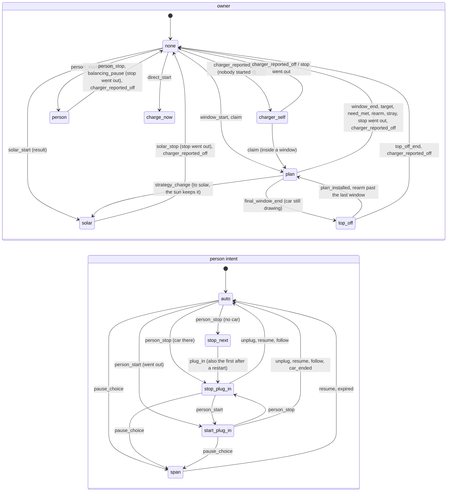

# Charge ownership: the session model and its shadow

> **Developer documentation.** The core described here runs in shadow mode: it decides beside today's code and
> records where it would differ, but it does not control any charger. Names and fields below follow the code and
> will change as the work goes on.

For developers. Who owns a charger's charge, and which person intent holds, is today the product of about fifteen
fields across `execution/controller.py`, `execution/window_hold.py` and the Auto settings' pause. The refactor
moves that into one explicit record and one pure decision. Step 1 (this) runs the new core **beside** today's
code, in shadow mode: it decides, compares and records, and never acts on a charger.

## The session (`core/session.py`)

`ChargeSession` is one frozen record per charger, serialised as JSON with a version field:

| Field | Meaning |
|---|---|
| `plugged` | The last connection the charger stated (`None` until one is known, as after a restart). |
| `owner` | `none`, `plan`, `solar`, `person` (a Start through the execution boundary), `charger_self` (it began by itself), `top_off` (past the plan's last window), `charge_now` (a start through the controller with no boundary). |
| `manual` | A person's Start or Stop pausing Auto for the plug-in session: `action` and `scope` (`plug_in`, or `next_plug_in` for a Stop given with no car). |
| `span_pause` | A pause the person picked for a span (`next_period`, `until_tomorrow`, `until_resumed`). Never beside `manual`. |
| `held`, `overridden` | The hold of a charge that began by itself outside a window, and a person's override of it. |
| `car_ended_at` | The car ended a person's charge by itself in this plug-in (R3). |
| `balancing_paused`, `paused_origin` | Load balancing holds a charge back, and whose it was. |
| `held_for_safety`, `safety_stopped_at` | That hold was a safety stop, resumed no sooner than its gap. |
| `hold_stop_*` | The stops under a person's Stop (C7): when they went out, the last try, the give-up, one on its way. |
| `pending` | A command the core asked for whose result has not come back. |

## Events, commands and the decision (`core/events.py`, `core/ownership.py`)

`decide(session, event, now) -> (session, commands)` is pure, deterministic and total. An event carries the facts
the decision needs that are not the session's own (the plan's windows, the sun's phase, what the charger reports).
Commands are intents: `Start(reason)`, `Stop(reason, clear_schedule)`, `Keep()`, `Notify(code)`. What became of a
start or stop comes back as `CommandResult(executed, balancing_held, unobserved)`, and only then does the owner
change: a stop that never went out keeps the owner (I4), a start that never went out owns nothing.

Events: `plug_in`, `unplug`, `connection_unknown`, `window_start` (timer, re-arm or plug-in), `window_end`,
`final_window_end`, `rearm` (outside every window, or past the last), `person_start`, `person_stop`,
`direct_start`/`direct_stop` (no boundary), `resume` (resume, follow, an expired span pause), `pause_choice`,
`strategy_change`, `solar_start`, `solar_stop` (also the take-over of a self-started charge), `charger_reported_on`,
`charger_reported_off`, `car_ended`, `balancing_pause`, `balancing_resume`, `target_reached`, `need_met`,
`top_off_end`, `plan_installed`, `plan_dropped`, `restart`, `timer`, `command_result`.

The rules are today's (`plans/ha_manual_override_and_fixes.md` and its three review rounds): the gate every
automatic decision asks, the manual pause and its scopes (C1, C2, C6), C7 with its gap and give-up (R5), the
car-ended rule (R3), load balancing's resume of a person's charge (C5, R4, P3), the hold, the claim, the stray
stop, the re-arm, the window ends, the top-off, the target and need-met stops, and the sun's start, stop and
take-over. Where the research found today's rules questionable, the core copies them; deciding them is step 2's.
Decided since (in today's code and the core together): a readable off report with no start of ours on its way
leaves the charge nobody's, whoever owned it, so a charge the charger later begins by itself does not inherit the
ended one's owner (inside a window the plan claims it again). A window's end stops only the plan's own charge (I3):
a person's Start, a Charge-now start and the sun's charge go on, and so does one load balancing holds back for
them; the last window's end then ends the plan with no stop and no top-off. The re-arm outside the windows (a new
plan installed between windows, a restore, a follow) spares the same charges: only the plan's own charge is the
plan's to stop. A charge balancing held back that was nobody's is resumed as nobody's (the charger's own once seen
charging), not as a Charge-now start. A window's end at which the next plan takes over (the execution boundary holds
it, waiting for that boundary, with a window open then: a best-effort plan ending at its departure while the next
departure's plan begins) stops nothing and records no end (`continued` on `window_end` and `final_window_end`;
`ChargingController._successor_continues`): the boundary installs the next plan at once, and its re-arm keeps the
charge. Installed first, the next plan cancels the end's timer and keeps the charge the same way, so the order of
the two does not matter; one that is not installed after all leaves the end as it always was. A strategy change
hands a running charge over instead of stopping it: to `solar`, the plan's charge goes to the sun with no stop when
the sun's rules keep it (`sun_keeps` on `strategy_change`: the surplus at or above the charger's stop level on the
reading at hand, and, running beside the plan, its own state `on`, never `disarming`), and is stopped once
otherwise. The other way, a plan window open when the sun runs a charge takes it over at its start
(`window_start`, no command), and the sun leaving it does not stop it.

## The shadow (`execution/ownership_shadow.py`)

At each place `ChargingController` or `AutoExecutor` changes who owns the charge or which person intent holds, or
sends a start or stop because of it, the same happening is fed to the core:

1. `begin()` before today's code acts: the core's session is lined up with today's state (`legacy_session`, read
   from the controller's fields and the executor's stored pause). A difference in the owner or the intent no event
   explains is **drift**, recorded and adopted.
2. `end(token, event, legacy=..., outcome=...)` after it: the core decides, the result of today's command is fed
   back, today's owner and intent are read again, and they and the commands are compared. A difference is a
   **disagreement**: logged at debug level and kept with the 20 events before it.

A feed that ends while another is open (inside it, or in another asyncio task: a report callback, a task Home
Assistant started eagerly) is queued and decided after it; the outermost feed compares the state after all of
them. A plug-in or an unplug ends a manual pause in the core at once, while today's boundary writes that a moment
later: the core's intent is kept until the boundary's own `check`. The shadow never raises into the real path:
every failure is caught and counted.

Diagnostics and the debug bundle (version 5) carry `ownership_shadow`: counts, the session, the last 50
disagreements and drifts and the last 200 events (facts only: no entity ids, no secrets). A charger's report of
its control is recorded only when the core decided something or something moved (`quiet` counts the others, and
one a disagreement comes of is kept after all), so a charger that reports every few seconds does not push the
plug-in and a person's actions out of the ring. `core/replay.py` feeds a bundle's events to the core again
(`python -m custom_components.spotnav.core.replay bundle.json`).

The counts and rings start again at every restart. Beside them, `ownership_shadow.coverage` (bundle version 6) is a
tally per event kind that is kept across restarts (`execution/ownership_coverage.py`, its own small store per
charger, written at most once every five minutes, at a shutdown and at Home Assistant's final write): for every kind
in `core/events.py` (zero until seen) the events decided, the comparisons, disagreements, drifts and failures, and
when one was first and last seen, since `since` under the integration's `version` then. Drift and a failure to line
up are counted under the event whose feed found them; what belongs to no event is `unattributed`. It says when the
core has seen every kind live often enough to take over; only removing the charger resets it.

## Step 2: the core drives, behind an option

A charger whose entry data says `core_ownership: true` (`const.CONF_CORE_OWNERSHIP`; no card or flow sets it, and it
is off otherwise) lets the core decide. Off, today's code decides exactly as before and the core only shadows it.
On:

* At every decision point fed to the shadow (a window's start and end, the re-arm, the stray stop, the top-off, the
  need-met stop, a report's hold, claim and stray stop, the stop under a person's Stop and its give-up, load
  balancing's resume, the sun's start, stop and take-over), today's code acts on the core's verdict
  (`OwnershipShadow.verdict`).
* A task a report or a timer spawns (the hold's stop, a stray charge's stop, the claim of a window charge, the stop
  under a person's Stop) keeps its re-check under the boundary's lock, and the re-check asks the core: the task's
  feed lines the session up at that moment and decides a `Recheck` event (the task's own command, awaited since the
  report, is taken back and asked for again only when still due); the core's verdict sends it. What it sent comes
  back as its `CommandResult`. With the option off the task sends what today's rule says, and the shadow compares.
* A person's Stop takes the plug-in session the core decides, and a plug-in or an unplug leaves the manual pause the
  core decided for it.
* After each feed a charge the core says nobody here owns clears today's two owner fields (`charge_origin`,
  `plan_charge`; `ChargingController._take_core_owner`), so everything that reads them follows it. One-way: an
  owner is never written back over them. Today's code sets them where it starts or claims a charge and forgets
  `plan_charge` by itself when it sees the charger off; writing the core's owner back after every feed would undo
  that at every report.
* An event whose facts are all known up front (a plug-in or an unplug, a person's Start or Stop) is decided when it
  begins, and a verdict a decision point asks for is that feed's decision at once: what happens inside it (a task
  Home Assistant starts eagerly) is decided after it.

The shadow still compares, before the owner is taken back, and counts each decision where today's rule on the same
state would have chosen otherwise (`verdict_differs`) and each time it cleared today's fields (`written_back`).
`SPOTNAV_CORE_OWNERSHIP=1` runs the whole test suite with the option on.

With the option on the core's session is also kept across restarts, as one versioned record per charger
(`charge_session` in the charger's store, `ChargeSession.to_store`) beside today's keys, which are still written as
before. The record leaves out what a restart clears anyway (`TRANSIENT_FIELDS`: commands awaiting a result, the stops
under a person's Stop and their give-up, the safety stop's gap). Every save of today's keys writes it as it is then.
A change of the owner or of the person intent no such save carried is saved at once, alone (today's keys as last
written beside it), in a task off the decision's path; the charger's own charge and nobody's count as one there (a
restart sees which again). Any other change is saved by the first decision at least `SESSION_SAVE_DELAY_S` after it
(no timer of its own, so no other timer moves), at Home Assistant's stop (`__init__._async_stop`, which unloads no
entry, so no controller's own shutdown runs; `ChargingController.async_flush_session`) and at an unload's shutdown,
which also saves a decision that finished while it waited for the lock. So a report that changes nothing stored
writes nothing and many bookkeeping changes in a row are one save. Beside the record, `charge_session_order` keeps
two marks on one counter: the core's last decision (`session`) and the last change of today's ownership keys
(`keys`), as each was written. At a restart the core decides from the record and compares it with today's restored
state, except that today's keys written after the record's last change (a start whose result had not come back when
they were saved) are the newer: the session is read from them then, and only the person intent from the record. A
record that is missing or of a version the core does not know is read from today's keys once (`legacy_session`) and
written. With the option off nothing of it is written or read: today's restore, exactly. In the shadow's facts, the
car-ended rule's answer is read only when the core drives; off, it is what today's rule read itself (a read of the
car's state of charge may move and save its anchor, so the shadow makes none).

Not yet the core's: load balancing's memory of the charge it holds, the hold's memory and the car-ended record, and
the session itself after the restart (all read from today's fields at each feed, which lines the session up).

## Tests

* `tests/test_core_ownership.py`: table tests of every rule.
* `tests/test_core_properties.py`: Hypothesis stateful tests over random event sequences (a person's Stop holds, one
  owner and one pause, I4, a person's Start is never stopped by automation, the pause ends at the unplug, a restart
  changes nothing).
* `tests/test_core_replay.py`: replay of a synthetic bundle and of a real charger's recording, and the shadow's own
  guarantees.
* `tests/test_core_drives.py`: the option, today's code following the core's verdict, the owner cleared one-way.
* `tests/test_core_recheck.py`: a background task's re-check asked of the core, and its command's result.
* `tests/test_core_session_store.py`: the stored record: round trip, migration from today's keys, an unknown version,
  no save at every report, and a restart in each scope of a manual pause.
* `tests/test_core_plan_ends.py`: 1.11's plan ends and replans in both modes: the best-effort plan's charge taken over
  at its departure by the next departure's plan, the replan a returning register reading asks for while the plan's charge runs, and a need met by that
  same reading.
* `tests/test_override_review_g.py`: the review before the merge into main: a real Home Assistant restart (no
  unload) with the sun's charge, no state-of-charge read by the shadow with the option off, diagnostics naming no
  entity, give-up counting in both modes, the re-arm sparing a Charge-now start, and the next departure's plan taking
  the charge over at a best-effort plan's departure in either order.
* Every restart test runs twice (`both_restarts`): after an unload (`World.restart`) and as Home Assistant's own
  stop, which unloads nothing (`World.ha_restart`).
* Every test runs with the shadow (`tests/conftest.py`, `ownership_shadow_agrees`) and fails on a disagreement or a
  drift nobody explained (`tests/shadow_known.py`).
