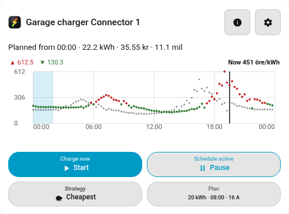
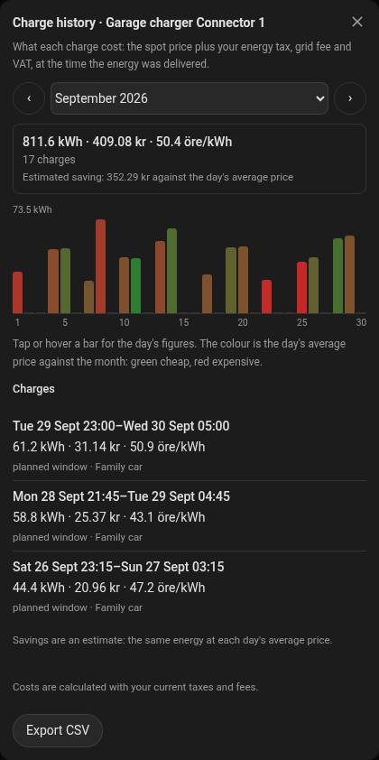
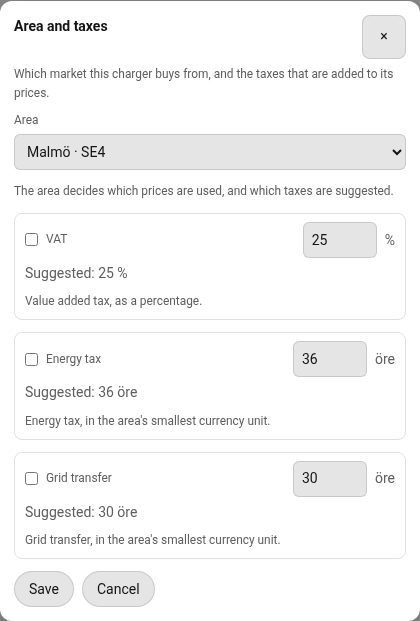
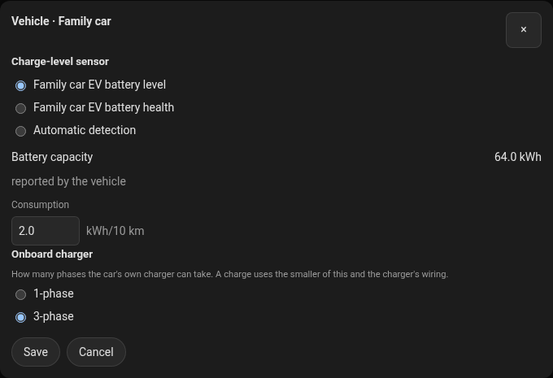
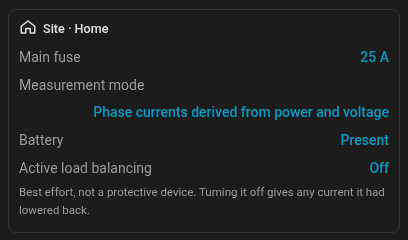
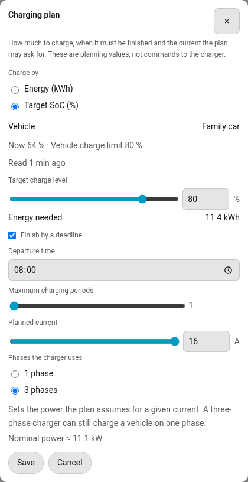

# The SpotNav card

The card is the day-to-day view of one charger: the price graph, the charging plan, the buttons
and all of the settings. One card shows one charger. [Add it](setup.md#3-add-the-card) from the
card picker, and add one card per charger.

Reading is open to every Home Assistant user. Changing anything needs an administrator; other
users see the values and a note that only administrators can change them.

## Header

The header shows the charger's name and three icons.

- **About this card** (the information icon) opens **What this charger can do**: automatic price
  planning, dynamic current limit, load balancing, and vehicle state of charge and target, each
  marked available or unavailable for this charger. An item that is unavailable here cannot be
  switched on from the card. The list is taken from what the integration reports for the charger.
- **Charge history** (the clock icon) opens [the charge history](#charge-history).
- **Card settings** (the gear icon) opens [the settings popover](#the-settings-popover).

When something needs attention, a banner says so: a notice in a neutral colour, or a message in
red when something must be fixed before charging can be planned. The banner counts the items to
review and opens the full list with the integration's own wording.

## The price graph

The graph shows the price of every interval, in the price area's currency per kWh.

- One horizontal axis is one local day, 00:00 to 24:00. Today is drawn over tomorrow, and an
  earlier day is subdued. Tomorrow's prices appear once they are published, usually in the
  afternoon.
- Bars cheaper than the day's average are marked as cheap and pricier ones as expensive. A line
  marks now, and the current interval is highlighted.
- The plan is drawn on top of the prices. **Scheduled** bands are the charging periods Home
  Assistant has installed and will follow. **Proposal** bands are a newer plan that is ready but
  not installed yet.
- A summary line gives the highest price, the lowest price and the price now.
- Touch or hover an interval to read its price. With the keyboard, the arrow keys step through the
  intervals, Home and End jump to the ends, and Escape clears the selection. Times follow the
  price area's time zone, and the autumn hour that repeats is shown with its offset.
- Press the summary line to fold the graph into a slim strip of the same day: the charging
  periods as bars (the ones already over dimmed), the line for now and the hours under it. Press it
  again to open the graph. The choice is remembered per charger in that browser. To start folded
  where nothing is remembered yet, add `chart: compact` to the card's YAML.

## The plan

Under the graph the card lists the charging periods: **Cheapest charging periods** for a
proposal, or **Scheduled charging periods** for the plan that is installed. Each period shows its
day and time, and a period that is running now is marked. The card also states the plan's energy
and cost and, when the vehicle's consumption is known, the distance the charge adds.

A plan that had to buy some energy before tomorrow's prices were published is flagged, because part
of it is charged without published prices.

## The buttons

A row of four cells sits under the plan. Each shows a state and opens or does one thing.

| Cell | What it shows | What it does |
| ---- | ------------- | ------------ |
| **Charge now** or **Charging** | Start when not charging, Stop while charging | **Start** starts a charge now and **Stop** stops it now. Either pauses automatic charging until the car is unplugged (a Start also until the car is full), and the Schedule cell then offers **Resume**. See [Start and Stop](strategies.md#what-every-strategy-shares). |
| **Schedule active** or **Schedule paused** | Pause or Resume | **Pause** suspends automatic charging and asks for how long: **Until the next planned period**, **Until tomorrow** or **Until I resume**. Only the choices the charger offers are listed. **Resume** clears the pause. |
| **Strategy** | The chosen strategy | Opens **Charging strategy**: **Cheapest**, **Solar** and **Hybrid**, see [charging strategies](strategies.md). A strategy that cannot work on this installation is listed with the reason, for example that Solar requires a site that can measure the solar surplus. |
| **Plan** | Energy, deadline and current, for example `20 kWh · No deadline · 16 A` | Opens the plan settings, see [Plan](#plan-settings). |

Start and Stop are disabled for a user who is not an administrator, and while a start or a stop is
waiting for the charger to acknowledge it (at most 30 seconds): the cell then says **Starting…** or
**Stopping…**.

## Status lines

The card words what the integration reports; the integration decides which lines appear and how
serious each is. Examples:

| You see | Meaning |
| ------- | ------- |
| Waiting for tomorrow's prices (~13:45), will plan then. | Prices for the deadline are not published yet; SpotNav plans when they are. The time is the area's expected publication plus 45 minutes, and is left out once it has passed. |
| Buying 12 kWh now, the rest when the prices are published. | The deadline needs hours that are not priced yet, so part of the charge is bought now. |
| Charging is scheduled from 02:00. / Planned from 02:00. | The installed plan, or a plan that is proposed. |
| A new charging proposal is ready. | A newer proposal exists and is not installed yet. |
| Charging now; scheduled until 05:30. | A charge is running inside a planned period. |
| Automatic charging is paused. / Schedule paused until 07:00. | A pause of the schedule is in effect (a charge may still run beside it). |
| Stopped manually – until the car is unplugged. / Charging manually – until the car is full or unplugged. | You pressed Stop or Start: automatic charging is paused for this plug-in. A Stop given with no car plugged in reads *until the next plug-in ends*; on a charger that cannot tell when a car is plugged in, *until you resume automatic charging*. |
| Stopped at 80 % (estimated, reading 40 min old) | The target was reached; shows the level the charge stopped at and how old or estimated it was. |
| Charging is limited to 10 A by the site's load balancing. | Active load balancing has lowered the current. |
| The home battery charges from the grid and shares the main fuse: the car gets 11 A. / House consumption limits the car to 11 A. | The same, with the cause when SpotNav knows it. |
| Solar · charging 9 A from surplus | The solar strategy's state: waiting for sun, surplus found and starting soon, surplus fading, charging, or no usable reading. |
| Hybrid · 12 kWh from grid, 8 kWh expected from sun | The hybrid plan's split; with no forecast source it says it plans like Cheapest. |
| The energy meter cannot be read: 6.5 kWh remains, from its last reading. / No energy meter: 3 kWh remains, counted from this charger's recorded charges. | The requested energy is counted without the charger's energy register, see [counting the requested energy](strategies.md#cheapest). |
| Charging was started, but the vehicle is not requesting current. | The connector reports the car is not asking for current. It is an observation only: check the car's charging settings or reconnect the cable. |

<!-- Screenshot to add when available:  -->

<!-- Screenshot to add when available:  -->

<!-- Screenshot to add when available:  -->

## Charge history

Every charge is recorded as a session, from the moment the charger starts charging, whatever
started it, until it stops or the car is unplugged. A pause of a couple of minutes (load balancing,
a window boundary) stays in the same session. The **Charge history** dialog shows one month at a
time, this month first: pick another with the arrows or the list of months that have charges (up to
24 months back). It shows the month's energy, cost, average price, number of charges and solar share,
a bar for every day (the height is the day's energy; the colour is the day's average price against
the month, green for the cheapest to red for the most expensive; hover or tap a bar for that day's energy,
cost, price and solar share), and the month's charges with how each started: a planned window, by
hand, solar surplus, hybrid, or started elsewhere.

- **Energy** comes from the charger's energy register, or from the power SpotNav integrates for a
  charger behind a smart plug. A charger with neither is **estimated** from the current it was
  asked for, and every figure built on it says so.
- **Cost** is the energy of each stretch of the charge times the effective price in that interval:
  the spot price plus your energy tax and grid fee, times VAT, as in the plan. A charge keeps its
  energy and the spot prices, not a finished cost, so the cost is calculated with your **current**
  taxes and fees every time it is shown: correct a VAT or fee and the whole history follows. Energy in
  an hour with no published price is counted but not priced. A charge recorded by an earlier version
  that only has its cost keeps that cost until its prices can be rebuilt.
- **Earlier charges** are imported once per charger, in the background after start-up, from Home
  Assistant's hourly long-term statistics of the charger's energy register (up to 24 months back, and
  only before the first charge SpotNav recorded itself). Consecutive hours with at least 0.1 kWh form
  a charge. They are priced from the market's day prices (hours with no price yet are counted but not
  priced, and priced on a later start once the prices exist) and marked **imported (hourly)**: the start
  cause and solar share are unknown. They count in every total.
- **Savings** compare with the same energy at the day's average price. It is an estimate, shown
  as one, and is negative when a charge happened to cost more than the average.
- **Export CSV** saves the sessions of the month shown, one row per session, in local time.

Sessions are kept for two years, per charger, and survive restarts. Each charger also has sensors
for the energy and cost this month and last month and for the last charge, which can be used on
Home Assistant's own dashboards and in automations.

## The settings popover

The gear icon opens **Card settings**, built fresh each time you open it. The plan and the strategy
have their own cells on the card; everything else is here, in sections.

### Price area and fiscal

On a new charger the area and the current are already filled in from your Home Assistant
country and location and from the charger, and the card says "Suggested from your location
and charger – check Settings."
Nothing you saved is overwritten. See [first-run defaults](setup.md#first-run-defaults).

Shows the area, the currency and the VAT, energy tax and grid fee as the plan applies them. **Edit
price area and taxes** opens the editor.

- **Area** decides which prices are used and which taxes are suggested. The list is grouped by
  country and is what the public SpotNav Relay publishes; if it cannot be reached, the last list Home Assistant received is
  shown with a note.
- **VAT** (as a percentage), **Energy tax** and **Grid transfer** (both in the area's smallest
  currency unit) can each be switched off, use the area's suggested value, or use your own value.
  **Reset to suggestion** returns to the suggestion when the area publishes one.
- Under the area, a small linked line names where its prices come from (ENTSO-E, Red Eléctrica
  for Spain's regulated PVPC, or Octopus Energy (Agile) in Great Britain).
- Where the published price already includes VAT, energy tax or grid transfer (all three in Great
  Britain), that component is checked, locked and marked **Included in the price**, and nothing is
  added for it. For Great Britain, **Find my region** looks the region up from a postcode (see
  [Great Britain: Octopus Agile](setup.md#great-britain-octopus-agile)); amounts are in pounds and
  pence and distances in miles.
- How the additions are applied, and what is not included, is in [Prices](prices.md#what-you-pay).

### Vehicle

One block per vehicle Home Assistant detected, with the one this charger plans for marked.

- The **vehicle charge level** sensor, and whether it is chosen automatically. **Change vehicle
  charge level** lets you pick another sensor or go back to automatic detection, which matters when
  a vehicle has several battery sensors.
- **Battery capacity** in kWh (1 to 500), unless the vehicle reports it, in which case it is shown
  as reported by the vehicle.
- **Consumption** in kWh per 10 km (0.1 to 50), used to show the distance a plan adds.
- **Onboard charger**: 1-phase or 3-phase (3-phase until you say otherwise). A charge uses the smaller of
  this and the charger's wiring, so a car with a single-phase onboard charger charges on one phase even
  on a three-phase wallbox.
- **Plug sensor** and **Location**: the car's own "plugged in" sensor and tracker, which tell which car is
  plugged in at a charger more than one car can charge at. Each is **Automatic**, one of the car's entities,
  or **None**. They are read only for that.

### Which car is plugged in?

Shown when more than one car is detected: **Identification** (**Automatic**, **Always ask** or **Off**) and
**Cars at this charger**, changed with **Change**. While SpotNav cannot tell which car was plugged in, the card
shows "Which car is plugged in?" with one button per car, the likeliest first; one tap is the answer, the
same as on the phones. The car line says how the car was decided ("identified by the car's charging cable",
"your answer", "assumed", ...), and **Change car** next to it lets anyone signed in correct it. See
[Which car is plugged in?](vehicle-identification.md).

Saving each value asks Home Assistant to confirm it; the card never shows a value the integration
did not accept.

### Phases

The phases a charge uses are not chosen in the Plan dialog. They are the smaller of the charger's wiring
and the vehicle's onboard charger. The Plan dialog says how many ("Charges on 1 phase · nominal power
≈ 3.7 kW") and, when the car limits it, why ("The car charges on one phase."). A charger in a site takes
its wiring from the site, which the charger's entities dialog states ("The charger is wired for 3 phases
(from the site)") with a link to the site's entities; a charger in no site has **Phases the charger is
wired for** (1 or 3) in its entities dialog.

SpotNav also learns the phases from your charges. A charge on three phases confirms the wiring and the car
(a charger in no site whose wiring was never set is set to three phases by its first such charge). When a
car charges on one phase twice running on three-phase wiring, the card asks "This car seems to charge on one
phase. Set its onboard charger to 1-phase?" with **Set to 1-phase** and **Keep 3-phase**; nothing changes
until you answer.

### Charger entities

For administrators. Lists the charger's entities (**Charge control**, **Current limit**,
**Energy register** and **Vehicle charge level**) and how SpotNav controls the charger: how it
starts and stops a charge, how the current is set, where the charging state is read, the charger's
write limits, and whether load balancing can change the current during a charge. If the charger's
own smart mode is on, the card warns because it can fight SpotNav. **Change charger entities** opens
the editor, where a charger on a site also has its **Charger priority** (first, normal or last; see
[site and load balancing](site-and-load-balancing.md)). Under **Energy**, **None** is kept as your
choice: SpotNav then reads no energy register and looks for none, and lists one it finds on the charger
under **To check**.

### Site

The section is headed by the site's name and says whether its settings apply to one charger or to
several. A charger with no site says so.

- **Solar priority**: **Car first** or **Battery first**.
- **Solar forecast sources**: the forecast integrations the site may use for Hybrid. Without one,
  Hybrid plans like Cheapest.
- **Active load balancing**: a switch for administrators, best effort and not a protective
  device. The card says when it is not available: the charger is claimed by more than one site, no
  charger on the site accepts a current command, or the site's own power measurement is not healthy.
  Turning it off gives back any current it had lowered, and the card reports each charger it
  restored.
- **Change site entities**: the main fuse and its safety margin, the measurement mode, the per-phase sensors, the signs
  of the meter, the home battery power and the maximum measurement age. **Found in Home
  Assistant** lists the grid meters and home batteries SpotNav recognised, with **Use this** to
  apply one. The editor warns about a source that updates more slowly than the maximum measurement
  age and about devices that balance load by themselves. With a Sigenergy battery whose **Grid Import
  Limitation** number is enabled, it also warns ("Two limits on one fuse") when that limit and SpotNav's
  (the main fuse minus the safety margin) differ by more than 1 A per phase.

### Notifications

**Phones** and **Events** say who is told about what; **Change notifications** opens the choice. See
[Notifications](notifications.md).

## Plan settings

The **Plan** cell opens **Charging plan**.

- **Charge by**: **Energy (kWh)** or **Target SoC (%)**. With a target SoC, see
  [target state of charge](target-soc.md).
- **Requested energy**: 0.5 to 100 kWh on the slider, in half-kWh steps; the number field accepts
  more.
- **Finish by a deadline** and **Departure time**. Without a deadline the plan covers the priced
  horizon.
- **Maximum charging periods**: 1 to 8.
- **Planned current**: the current the plan may ask for, in whole amperes, with the nominal power
  it means for the phases the charge uses (read-only, see below). It is a planning value, not a command
  to the charger.
- With a target SoC: the **Target charge level** slider, the vehicle (when there are several), the
  level now and how old it is or that it is estimated, the vehicle's charge limit when known, and
  the **Energy needed**.

If two clients change the settings at the same moment, the card says they changed elsewhere and
offers **Use the server values** or **Apply my change again**; nothing is overwritten silently.
