# Set up SpotNav

This page walks through the whole setup in Home Assistant, dialog by dialog. It assumes you
installed SpotNav from HACS and restarted Home Assistant (see the [README](../README.md)). Nothing
here needs an account or an API key.

There are four steps, and only the first is required:

1. [Add a charger](#1-add-a-charger).
2. [Add a site](#2-add-a-site-optional) if you want load balancing or solar charging.
3. [Add the card](#3-add-the-card).
4. [Pair the app](#4-pair-the-app-optional) if you want to use the SpotNav app.

Add the charger first and the site second. The site's dialog then lists the charger and can
include it straight away. If the site came first, add the charger later: the last dialog of the
charger flow offers to join the site (see [Add the charger to an existing
site](#add-the-charger-to-an-existing-site)).

Everything else, such as price area, the energy to charge and the departure time, is set
in the [card](card.md).

### First-run defaults

A new charger starts with a working card instead of an empty form. When the charger is added,
SpotNav fills in only what Home Assistant already knows:

- **Price area**: the area for Home Assistant's country. A country with several areas (Sweden,
  Norway and Denmark) gets the area nearest to Home Assistant's configured location. With no
  country, an unlisted country or a location far from every area, the area is left empty.
- **Amps**: the charger's own maximum when it states one, otherwise 16, and never above the site's
  main fuse minus its safety margin.

The card says so: "Suggested from your location and charger – check
Settings." Check the values in **Settings** and change any that are wrong. Nothing you have saved is ever overwritten, and a
value you clear is not filled in again.

## 1. Add a charger

Go to **Settings, Devices & services, Add integration** and search for **SpotNav**. The first
dialog asks what to add.

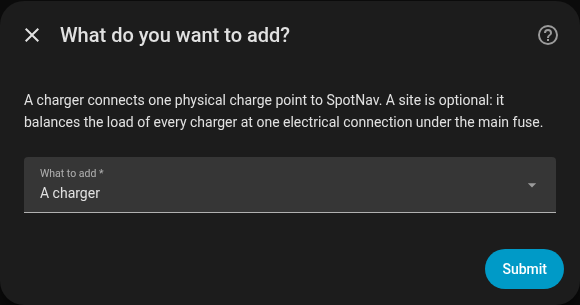

Choose **A charger**. (A third choice, **Resolve a detected vehicle**, appears only when SpotNav
found a car with several battery readings and needs you to say which one is the state of charge.)

The next dialog asks how to find the charger.

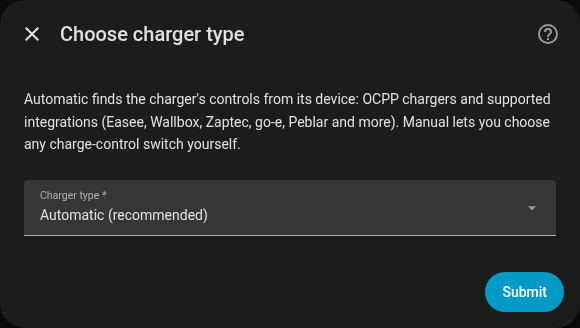

- **Automatic (recommended)** is the default and the right choice for every charger listed on the
  [supported hardware page](supported.md). SpotNav reads the charger's own integration and finds
  the controls itself.
- **Manual** works with any charger that exposes a switch. See
  [the manual path](#the-manual-path).

### Automatic: pick the device

With **Automatic**, choose the charger's device from the list. The list shows device
names and their area.

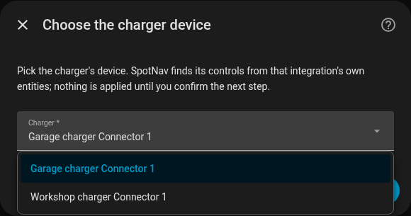

For an OCPP charger the list shows the connectors, not the charge point or the central system, so
a charge point with two connectors appears twice and you add each connector on its own. For other
integrations a device is listed when it has at least one entity.

SpotNav then finds the charge control, the current setting, the energy meter and the status
sensor from that device's entities. It matches entities by the integration and the entity's key,
never by name.

If the charger has its own smart, solar or load-balancing mode switched on, SpotNav stops and asks
you to turn it off in the charger's own integration or app first: two controllers on one charger
fight each other. Turn it off and continue. There is also a tick box to continue anyway if you
accept that they may fight. If the integration is evcc or openWB, SpotNav warns that they may own
the charger and suggests nothing.

Smart charging that runs in a cloud app is not visible to Home Assistant, so SpotNav cannot warn
about it. If the charger is linked to Tibber (or another app) for smart charging, turn that off:
the Easee setup step says so. Home Assistant's Tibber integration only reads a linked charger and
exposes no control, so there is nothing to detect.

### Confirm what was found

When SpotNav finds one unambiguous answer it shows it and asks you to confirm instead of asking
you to fill in a form.

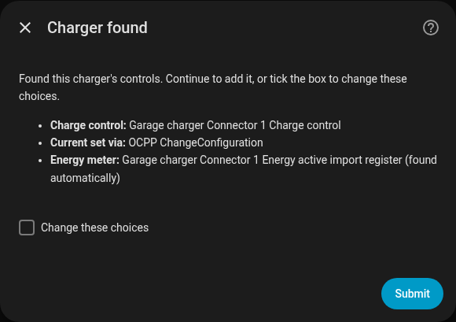

For an OCPP connector the dialog names the charge control, how the current is set and the energy
meter, which is found automatically. Choose **Submit** to add the charger.

How the current is set is decided by asking the charge point, not by its make or model. SpotNav
asks for the `AssignedCurrent` configuration key. If the charge point has it for this connector,
the current is set through OCPP `ChangeConfiguration`. If it answers without it, the connector's own
session current limit number is used when there is exactly one, and otherwise SpotNav does not set
the current. If the charge point does not answer at all, for example because it is not connected
yet, nothing is decided and you get the form below with a message asking you to wait until the
charger is connected and submit again, or to choose yourself.

### Change these choices

When the device offers more than one charge control, or the charge point could not be asked yet,
SpotNav shows the entities form straight away. Otherwise tick **Change these choices** and submit
to see it.

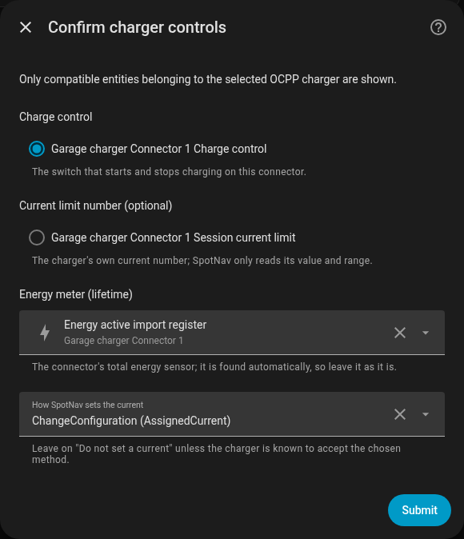

For an OCPP connector the form has:

- **Charge control**: the switch that starts and stops charging on this connector.
- **Current limit number (optional)**: the connector's own current number.
- **Energy meter (lifetime)**: the connector's total energy sensor. It is found automatically, so
  leave it as it is unless it is wrong.
- **How SpotNav sets the current**: **Do not set a current**, **ChangeConfiguration
  (AssignedCurrent)** or the charger's current number. Leave it on **Do not set a current** unless
  you know the charger accepts the method.

For a charger found through another integration the confirm dialog is this form directly, titled
with the device name: **Charge control**, **Charging current number (optional)**, **Set the
charger current**, **Energy register (optional)**, **Status sensor that says it is charging
(optional)** and, where SpotNav knows a per-session register only, a tick box to use it. Change or
clear anything that is wrong. **Set the charger current** stays off unless you choose it, and then
SpotNav writes the current only as the charger's write limits allow (see
[supported hardware](supported.md)). If the integration ships useful entities disabled, a tick box
offers to enable them, and it is on by default.

A charge control or current number can belong to only one SpotNav charger. Choosing one that
another SpotNav charger already uses is refused.

### Add the charger to an existing site

If you already have one site, the last dialog of the charger flow offers to add the new charger to
it. To add a charger after the site, go to **Settings, Devices & services, SpotNav, Add entry**,
choose **A charger**, and answer yes when it offers to join the site.

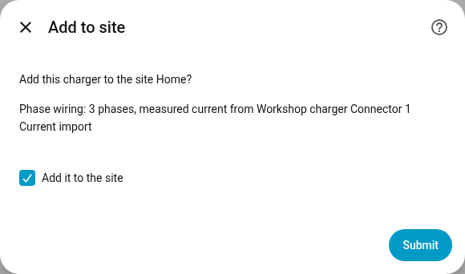

The dialog appears only when exactly one site exists. SpotNav offers to add the charger only when
it can tell how it is wired: three phases and exactly one measured-current source found on the
charger's device. Then the dialog shows the wiring it would use and a tick box, **Add it to the
site**, which is on by default. Otherwise the dialog says SpotNav cannot tell how the charger is
wired, so it is not added automatically; add it from the site's settings (see [Change these
choices later](#change-these-choices-later)).

### Renaming a charger

Renaming a charger's entry under **Settings, Devices & services, SpotNav** changes the name shown
in the card and the app. It does not change any entity id.

### The manual path

Choose **Manual** for any charger that exposes a switch. The form asks for:

- **Charge control**: the switch that starts and stops charging.
- **Charging current (optional)**: a number entity that sets the current.
- An optional energy meter sensor (a total energy sensor), which lets SpotNav know how much energy
  a charge has already delivered.
- An optional **power sensor (smart plug)**, for a charger that is only a plug with a charger behind
  it. See [a dumb charger behind a smart plug](supported.md#a-dumb-charger-behind-a-smart-plug).

### When detection finds nothing

If the list of devices is empty, SpotNav stops with the message that no supported charger was
found. Set up the charger's own Home Assistant integration first, then add it here, or choose
**Manual**.

If you pick a device whose integration SpotNav knows but cannot command, the flow says SpotNav
cannot start or stop the charger and that it can only be read. The
[supported hardware page](supported.md) lists which integrations are which. A device that
SpotNav knows is not a charger, such as a heater or an outlet controller, is never offered in the
list.

## 2. Add a site (optional)

A site is one electrical connection, usually your main fuse, shared by one or more chargers. You
need it for [load balancing and solar charging](site-and-load-balancing.md). A charger can belong
to only one site.

Go to **Settings, Devices & services, Add integration, SpotNav** and choose **A site (load
balancing)**.

A site with no charger yet is fine, but nothing is shared until it has one, and the card needs a
charger to show anything. The site's setup step, its Repairs entry and its own sensor all say the
same thing: **Add a charger: Settings, Devices & services, SpotNav, Add entry, Charger; it will
offer to join this site.**

### The basics

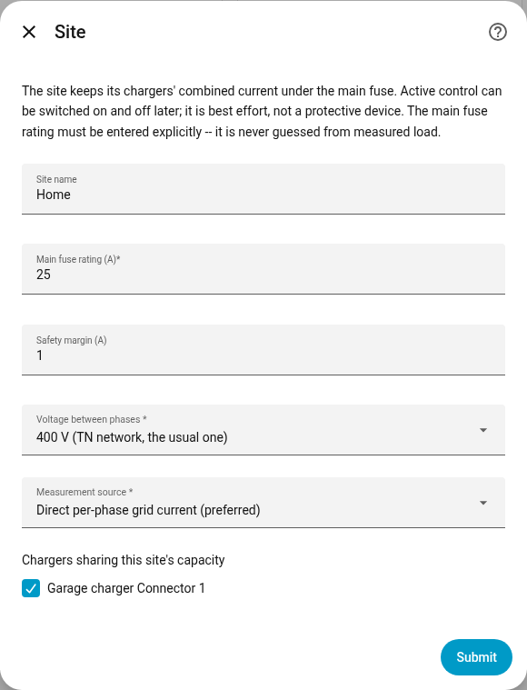

- **Site name**.
- **Main fuse rating (A)**: always entered by you, never guessed from measured load.
- **Safety margin (A)**: kept below the fuse rating. It starts at 1 A.
- **Measurement source**: **Direct per-phase grid current (preferred)**, or **Derived from power
  and voltage**. Derived is more exact when the meter also reports its own current, apparent or
  reactive power, and otherwise the current is estimated.
- **Chargers sharing this site's capacity**: pick the chargers on this fuse. A charger already on a
  different site is not offered. When there is only one charger it starts selected.

### The grid meter

SpotNav now scans Home Assistant's entity registry, including entities their integration ships
disabled, for grid meters. If it finds any, it lists them.

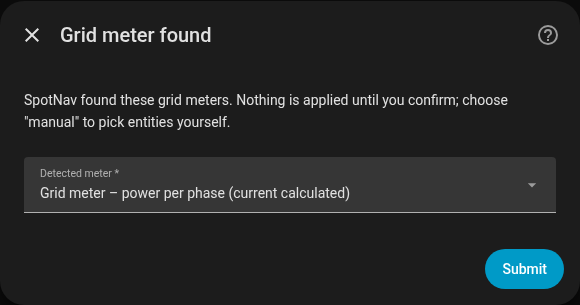

Choose the meter that measures your main feed, or **Choose manually** to pick entities yourself.
If the meter needs entities its integration ships disabled, a tick box, on by default, enables
them. SpotNav enables only entities the integration disabled, never ones you disabled yourself.
Nothing is applied until you confirm.

### Site found

When the meter, the chargers' measured currents and the wiring are all found without ambiguity,
SpotNav shows a summary instead of the full form.

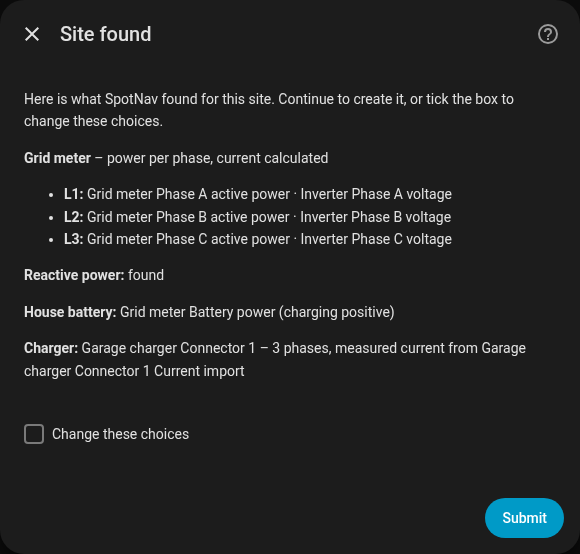

The summary has one line for the measurement, the voltage, reactive power if found, the house
battery (or that there is none), and each charger with its phases and the sensor
its current is measured from. Submit to create the site, or tick **Change these choices** to see
the full form with everything pre-filled.

The site is created with its calculation on and **active control off**. Turning active control on
is a separate, later decision (see [the card](card.md#the-settings-popover)).

### When the meter is not found

If SpotNav finds no grid meter, or finds one but cannot complete the summary (for example a
charger with no single measured-current sensor), it goes on with the forms.

Manual measurement has two shapes. Choose **one entity with the three phase currents as
attributes** when a single entity carries them (the Easee Equalizer does). Choose **three separate
entities, one per phase** when each phase is its own sensor, which is typical for P1 readers. A
sensor without a device class can be picked, which a DIY meter reader needs. SpotNav checks the
unit instead: current in A or mA, power in W or kW, voltage in V, reactive power in var or kvar,
and apparent power in VA or kVA; a sensor in another unit is refused.

- In direct mode **Site current source suggestions** lists current sources found among existing
  entities, **Choose manually (three separate entities, one per phase)**, **Enter one entity + its
  phase attributes manually**, and **Skip for now (configure later)**. The last one lets you create
  the site now and add the measurement later.
- **Site current from one entity** is for a meter that carries the whole site's current as per-phase
  attributes of one entity: pick the entity, name the attribute that holds each phase, and choose
  the unit of those attributes, **A** or **mA**. SpotNav checks the attribute names against the
  entity's state and its recent history and asks you to tick **save anyway** only when it could
  verify nothing.
- **Phase wiring and measurement entities** asks, for each charger, whether it is three-phase or on
  one phase, and for a single-phase charger which phase. It also asks, when not already chosen, for
  the per-phase sensors: a current sensor per phase in direct mode, or a power sensor and a voltage
  sensor per phase in derived mode, with optional export power, reactive power, apparent power and
  current. Two tick boxes say how your meter's signs work: **The grid current is signed (export is
  negative)** and **Grid power is export-positive (negate it)**, which applies to the per-phase
  power in derived mode and to the total grid power in either mode. In the card's site editor,
  direct mode also has **Total grid power (for solar)**, needed for solar and hybrid charging when
  the phases only report current (and an optional separate export sensor). Each charger
  also has an optional measured-current source, chosen from what SpotNav found on the charger's
  device, entered manually, or skipped. Never use a commanded current there: a car can draw less
  than its setpoint.

A charger's own measured current can also be three separate entities, one per phase (the Charge
Amps integration and similar). SpotNav suggests them automatically when they are on the charger's
device.

If both an Easee Equalizer and a real grid meter, such as a P1 reader, are found, SpotNav lists the
meter first. Prefer the meter: the Equalizer reports a derived figure and balances load by itself.
If SpotNav does the load balancing, turn off the charger's own smart charging and the Equalizer's
load balancing, because two controllers on one charger fight each other.

A single-phase charger whose phase is unknown never gets a recommendation, so choose its phase.

## 3. Add the card

The card is served by the integration itself. There is no dashboard resource to add, and nothing to
update after an upgrade except reloading the browser once.

After the first install the card may be missing from the card picker until the browser page is
reloaded with Ctrl+Shift+R. In the Home Assistant companion app, reset the frontend cache instead
(in the app's settings, under Troubleshooting).

Open a dashboard, choose **Add card**, stay on **By card** and search for **SpotNav**. The
picker shows a preview. If you have exactly one charger, the preview is the real card for it.

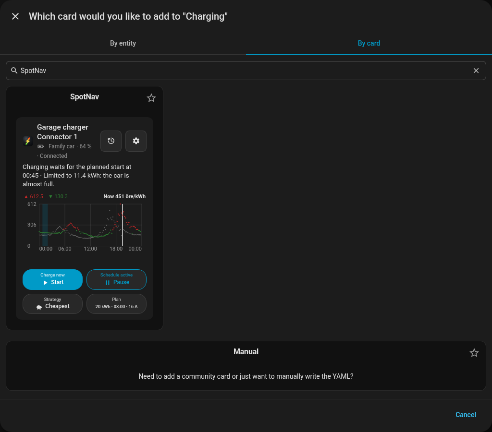

Add it and pick the charger in the card's editor. By hand, in YAML:

```yaml
type: custom:spotnav-card
charger: <charger config entry id>
```

The card is described in [The card](card.md).

## 4. Pair the app (optional)

1. In the SpotNav app choose **Log in to Home Assistant** and enter your Home Assistant address.
2. The app shows a six-digit code. Home Assistant shows a new item under **Settings, Devices &
   services** named after the phone, with the same code.
3. Check that the codes match and choose **Approve**. **Deny** refuses the request.

<!-- Screenshot to add when available:  -->

A pairing request expires after five minutes; start again on the phone. No Home Assistant password
or access token is ever stored on the phone. Approving hands over the chargers of this instance,
each with its own private webhook secret. Treat webhook ids as secrets. See
[Apps and API](api.md).

## Change these choices later

- **A charger's entities.** Open the charger's card, then **Card settings**, then **Charger
  entities, Change charger entities**. Administrators can also use **Configure** on the charger's
  entry under **Settings, Devices & services, SpotNav**, which shows **Charge control**, **Charging
  current (optional)**, the energy meter and **Set the charger current**.
- **A site.** Use **Configure** on the site's entry. The first step, **Site capacity settings**,
  has the site's basics, whether the calculation is on, active control, the damping and yield
  settings, solar priority, the home battery power sensor and the solar forecast sources, and a tick
  box **Change measurement and phase wiring**.

  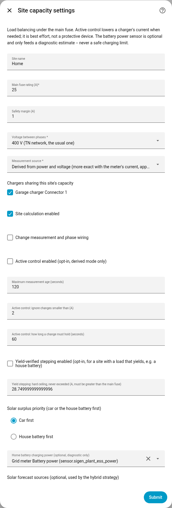

  With the box unticked, saving changes only the basics and keeps the stored measurement and
  wiring. SpotNav opens the measurement and wiring step anyway when the measurement mode changed,
  when chargers were added or removed, or when the measurement is incomplete.
- **The site's entities**, from the card: **Site, Change site entities**.

See [Diagnostics and troubleshooting](troubleshooting.md) if something does not behave as expected.
