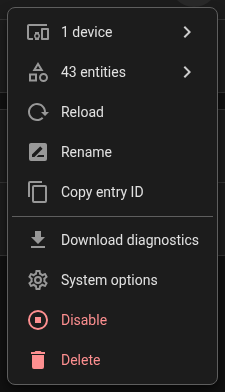

# Diagnostics and troubleshooting

## Diagnostics

Download diagnostics from **Settings, Devices & services, SpotNav**, the entry's menu, then
**Download diagnostics**.

 The file has the entry's configuration, price data state, the planner
and controller state, and for a site the measurements, their ages and the load-balancing
decisions. The webhook id and OCPP charge point id are redacted, and no webhook or pairing URL is
included, so the file is safe to attach to a public bug report.

The site entry's file (and the card's **Download debug info** in Settings, Support, for
administrators) also carries the whole installation as one debug bundle (`bundle_version` 6):

- `history_60min` per site: the last hour, one sample a minute kept in memory (nothing is read from
  the recorder). Each sample has the grid's total power, the site's current per phase, the house
  battery's power and, per charger, its measured current, charge control, connection and connector
  status and the car's state of charge. There is no PV power: a site has no PV sensor to read.
- `solar_decision_log` in the site's diagnostics, per charger: what solar and hybrid decided, the
  last 200 (time, strategy, state from and to, action, reason, the current asked for, the surplus,
  export, battery, grid and car power and the priority). Only changes and actions are kept, never an
  unchanged tick. While a plan's period holds the charge (hybrid), nothing the sun decides reaches the
  charger, so only a change of its state is kept.
- `client`, added by the card to the file it saves: the card version and bundle hash this browser runs
  and a short user agent, next to the backend's `versions.card_bundle_hash` (the file) and
  `card_bundle_hash_served` (the one browsers are handed). When they differ, the file says so in
  `client.note`, and the card's Support section says it too: the browser or the Companion app runs an
  older card. Reload the page; in the Companion app, force-stop the app and open it again.
- `ownership_shadow.coverage` in each charger's controller diagnostics: per event kind of the
  charge-ownership core (every kind, zero until seen), how many events it decided, compared,
  disagreed on, found drift at and failed on, and when it first and last saw one. Unlike the rest of
  `ownership_shadow` it is kept across restarts, from `since` (under the integration's `version`
  then) until the charger is removed.

To check a saved bundle's charge-ownership recording offline, run
`.venv/bin/python tools/replay_bundle.py bundle.json` in the integration's repository (no Home
Assistant needed; `--charger <name or id>` picks one charger, `--json` gives machine output). For
each charger it prints the shadow's counts, its coverage per event kind (version 6 and later), and
the recorded disagreements and drift, replays the
recorded events through today's pure core, and says whether the core now decides differently from
the recording or from the code that ran. A charger without the `ownership_shadow` block (a bundle
from before version 5) is reported as having nothing to replay. The exit code is 1 when a replay differs.

Useful entities on each charger: *Auto plan state*, *Auto execution state*, *Next planned
charging start*, *Planned cost* and *Auto settings revision*. On a site: *Capacity state*, *Solar
surplus* and one *Proposed current* sensor per charger.

## Setting up

- **"No supported charger was found."** The list of devices was empty. Set up the charger's own
  Home Assistant integration first, then add the charger here, or choose **Manual**. See [Set up SpotNav](setup.md#when-detection-finds-nothing).
- **"SpotNav cannot start or stop this charger. It can only be read."** The charger's integration
  is known but has no control SpotNav can use. See [supported hardware](supported.md).
- **"The charger did not answer, so SpotNav cannot tell how its current is set."** An OCPP charge
  point is asked how its current can be set, and it was not connected. Wait until it is connected
  and submit again, or choose how yourself.
- **"The charger's own control is still on."** The charger's own smart, solar or load-balancing mode
  is on. Turn it off in the charger's integration or app and continue, or choose to continue anyway.
- **A start is sent but the charger does not charge, or something else changes it back.** Only one
  controller may drive a charger. Turn off the charger's own smart charging (Easee: its smart
  charging switch) and any other integration that controls it, such as EV Smart Charging.
- **"This charge control is already used by another SpotNav charger."** A charge control or current
  number can belong to only one SpotNav charger.
- **"{name} and this charger are the same physical charger."** Two SpotNav chargers share a Home
  Assistant device, a measured-current sensor, an OCPP connector or an Easee device, so they would
  send one charger conflicting commands. The setup refuses the second one. For two that already
  exist, the card names the other charger and **Settings, System, Repairs** lists the pair: remove
  one under **Settings, Devices & services, SpotNav** (the entry's menu, **Delete**). SpotNav never
  removes one for you. Two connectors of one charge point are two chargers and are not flagged.
- **A new charger was not added to the site.** Only a charger whose wiring SpotNav can tell (three
  phases and exactly one measured-current source on its device) is offered to the site. Add it from
  the site's **Configure**.
- **A site has no charger.** The card is shown per charger, so a site on its own has no card. Add a
  charger: **Settings, Devices & services, SpotNav, Add entry, Charger**; it offers to join the
  site. The same sentence is in the site's Repairs entry and in its sensor's `next_step` attribute.
- **The site needs its meter chosen.** When no grid meter is found, pick the entities yourself or
  skip and finish later under the site's **Configure**. See
  [Set up SpotNav](setup.md#when-the-meter-is-not-found).

- **"Unknown error occurred" in a setup dialog.** SpotNav hit an unexpected error. Open
  **Settings, System, Logs**, choose the menu (three dots) and **Show full logs**, search for
  `spotnav`, and copy the whole traceback. Note your Home Assistant version and open an issue with
  both.
- **Setting up a meter that updates every second is slow.** The site's meter is read live only, and
  the Recorder's history is no longer searched for it (since 1.0.1). The only history search left
  is for a charger's own measured current: it covers the last two days and stops after ten
  seconds, so a very chatty sensor cannot hang the dialog.

## Charging

- **OCPP entities are unavailable after a restart.** Give the charger time to reconnect.
- **The wrong connector is used, or the current is not applied.** See
  [OCPP chargers](ocpp.md#which-connector). Choose the Charge Control switch for the outlet you
  use under the integration's **Configure** action.
- **A remote start or stop is rejected.** There may be no active transaction, or the connected
  vehicle is not requesting energy.
- **Nothing is planned.** The card lists what is missing, for example the price area or the charging current.
  While tomorrow's prices are not published, SpotNav buys what the deadline requires now and plans the rest
  later.
- **The plan is proposed but not applied.** The card shows a newer proposal until it has been
  installed; check *Auto execution state* and whether automatic charging is paused.
- **Prices are stale or missing.** Prices come from the public SpotNav Relay. If the relay is unreachable, the last successful
  fetch is used and the card says the prices are stale. No token or account is involved.
- **Helping test the new charge-ownership logic.** A new core that decides who owns a charge runs beside today's
  logic and controls nothing: it only records where it would have decided otherwise. Downloading the debug info
  (card Settings, Support) after a few days of ordinary charging, and sending it with an issue, helps it get there.

## Vehicles

- **A vehicle needs a decision.** A device reports several battery readings or charge limits. Open
  the repair under **Settings, System, Repairs** and choose which reading to use.
- **The charge-level sensor is wrong.** In the card's vehicle settings choose another sensor, or set it back to automatic.
  The services `dismiss_vehicle`, `undismiss_vehicle` and `unconfirm_vehicle` do the same by device id.

## Site

- **`invalid_measurements`.** The chargers' measured currents together exceed the site's total on
  a phase. Usually a wrong sensor, a sensor mapped twice, or the wrong phase.
- **Load balancing cannot be turned on.** The card says why: no commandable charger, a
  measurement that is missing, or a charger that belongs to more than one site.
- **"L2 and L3 have no value (sensor.…)" or "L1 is older than 120 s."** The card's status line and the
  site's measurement settings name the phases that make the site's measurement unusable and the
  sensors they are read from. No value means the sensor is missing, unavailable or not a current;
  older than the maximum age means it stopped reporting. Fix that sensor or the mapping; load
  balancing and solar wait until all three phases read.
- **Measurements are old.** Raise *maximum measurement age* only if the sensor really updates that slowly.

## Phone and pairing

- Internet addresses need HTTPS. Plain HTTP works only for private local addresses and works only while the phone
  is on that network.
- A pairing request expires after five minutes. Start again on the phone.
- If a webhook id has leaked, remove the charger and add it again to generate a new one.
