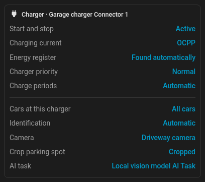
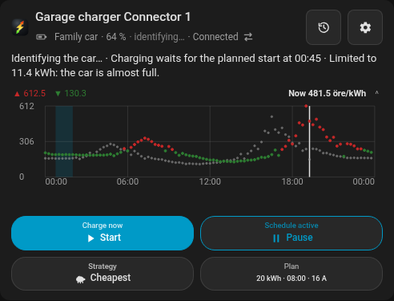
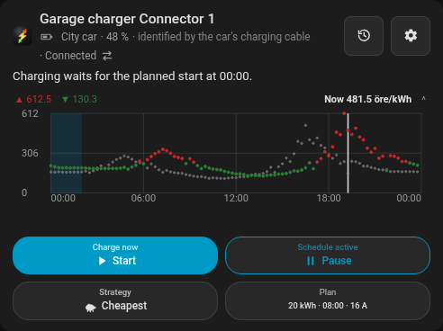
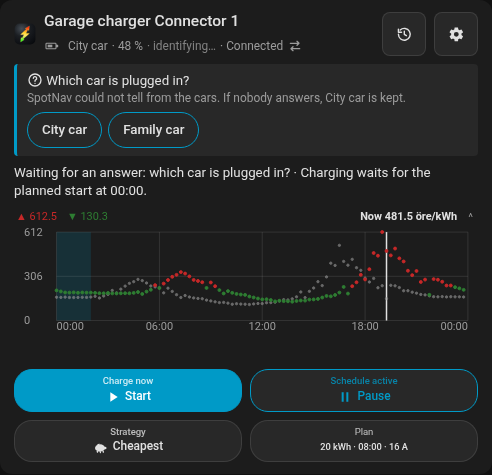
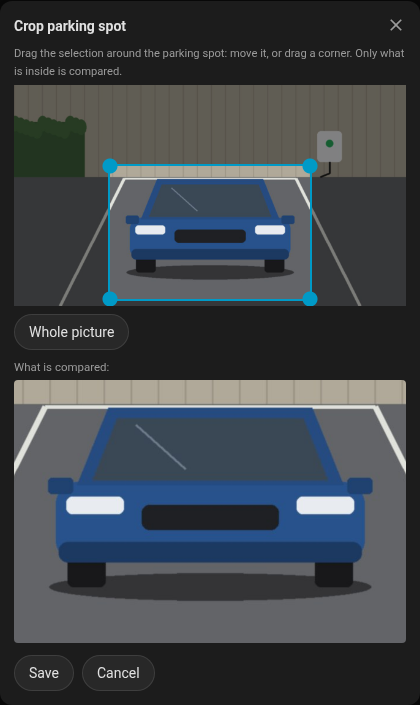
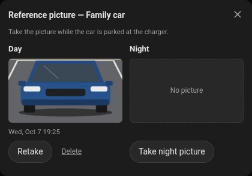

# Which car is plugged in?

When two or more cars share a charger, SpotNav has to know which one was plugged in. It plans from that car's
charge level, battery size, onboard charger and target. Chargers do not report the car, so SpotNav reads what
the cars report about themselves, and asks you when that is not enough.

This runs only for a charger that more than one car can charge at. With one car nothing is identified and
nothing is asked.

## Settings

All of these are in the card's **Settings**: the charger's section (its identification rows are shown when more
than one car is detected) and, per car, the car's tab in the **Car** section. Only an administrator can change
them.

- **Vehicles at this charger.** These are the cars that can charge here. By default every car SpotNav detects
  is included. At least one must be ticked.
- **Which car is plugged in:**
  - **Automatic** (the default). SpotNav uses the cars' own reports, and asks only if they cannot decide.
  - **Always ask.** SpotNav asks at every plug-in and never switches the car by itself.
  - **Off.** The car stays the one you chose.
- **Camera, Crop parking spot and AI task** (under the charger, shown when Home Assistant has a camera and an AI Task
  entity): see [The camera](#the-camera). Off until you choose a camera.
- **Per car: Reference picture**: see [The camera](#the-camera).
- **Per car: Plug sensor and Location.** These are the car's own "plugged in" sensor and its tracker, as
  SpotNav found them. If a car has more than one, you choose. You can also choose **None**, or go back to
  **Automatic**. SpotNav only reads these entities, and only for identification. They are never used as a
  charge level, a range or a way to start or stop a charge.

The **target** belongs to the car: each car has one target percent, the same at every charger. Changing it at
one charger changes it at every charger planning for that car, and when the car at a charger changes, its own
target comes with it. When two chargers change one car's target in quick succession, the later change wins
everywhere; a change of anything else at a charger (a departure, the current) never moves a target. The
**departure** belongs to the charger and stays as it is. A car with no target of its own takes, when SpotNav
starts, the highest target any charger planned it to before this feature (it is never left short), and every
charger planning for it is aligned once.

**Vehicles at this charger** also limit what the charger plans for: only those cars are offered as the target
vehicle in the card and the app, and with one car ticked that car is planned for.

## What happens at a plug-in

SpotNav starts when the charger reports that a car was plugged in. A charger that cannot tell whether a car is
connected never starts identification, so the choice stays yours.

1. SpotNav asks Home Assistant to re-read each car's plug sensor and tracker. It uses
   `homeassistant.update_entity` and never a brand's wake-up, at most once a minute per car. Waking a car
   costs its 12 V battery and part of the account's daily limit.
2. It then weighs what each car says:
   - **A car's plug sensor turned on** from five minutes before the plug-in. That car was plugged in.
   - **A car whose plug sensor went to "not plugged in"** around or after the plug-in is not here. A sensor
     that only says "not plugged in" again rules nothing out: cloud integrations write their cached value
     again on every poll (Kia's cache can say "not plugged in" for hours after the car was plugged in), and
     SpotNav's own re-read makes them write it too.
   - **A fresh position away from home** means that car is not here. "Fresh" means reported after the plug-in,
     or at most two minutes before it, and not just written again by SpotNav's own re-read. An older position may be the car's last report on its way home (many
     cloud integrations report every half hour), so it rules nothing out and SpotNav asks instead.
   - **A car already identified at another SpotNav charger** that is connected is not here. A car decided there
     counts at once, even while that charger's settings are still being saved, so two chargers never take the
     same car.
3. In **Automatic** mode, SpotNav picks a car without asking in two cases: exactly one car says it was
   plugged in, or every other car is ruled out. If two cars both say they were plugged in, SpotNav asks at
   once. Otherwise it waits three minutes and then asks. It keeps listening for 30 minutes after the
   plug-in, and if a car's own report settles it before anyone answers, SpotNav switches to that car. It
   switches automatically at most once per plug-in.
   With a [camera](#the-camera), SpotNav also asks the camera while the cars' own reports have not decided.
4. In **Always ask** mode, SpotNav asks at once. The cars are ordered by what they report, and SpotNav
   never switches by itself.

While SpotNav identifies the car, the card's and the app's status line leads with **Identifying the car…**, and
while the question is open with **Waiting for an answer: which car is plugged in?**. The line is gone as soon as
the car is decided (by the cars' reports, the camera, an answer, or a swiped question).

Once decided, the card's car line says how, for example **identified by the car's charging cable**, and ends in
⇄ (**Change car**).

A car's plug sensor may report late, depending on the integration. Many cloud integrations report within
seconds to ten minutes, but some only every 30 minutes or more. If the report comes late, SpotNav asks.

## The question

The question goes to the phones chosen under **Settings → Notifications**, as the event **Which car is plugged
in?**. This event is on by default. It is a notification with one button per car. Android shows at most three
buttons, so with more cars the two likeliest get a button and a third opens SpotNav. The card shows the same
question as a banner with one button per car, and so does the SpotNav app.

- The **first answer wins**, from any phone, the card or the app. Any Home Assistant user may answer in the
  card; changing the identification settings stays an administrator's. Choosing the car in the card's or app's
  settings at the same time also counts as an answer. A person's answer always beats what the cars report.
- When the question is answered, or a car's report settles it, the notification on every phone is replaced
  with "Tesla selected." or "Tesla selected automatically." The replacement is silent: it does not alert again on
  Android, and iOS delivers it passively, without a sound or a banner.
- **No answer keeps the current car.** If the notification is swiped away on Android, the current car is
  kept too, and nothing switches it later.
- Unplugging the car for more than two minutes takes the question off the phones. A shorter unplug is looked at
  again. When nothing new is reported (a reseated cable, a connector that flaps) it is the same plug-in: what
  was decided or answered holds, and it still counts toward the one automatic switch. When the decided car
  reports, since the unplug, that it is not plugged in or away from home, or (unless a person answered)
  another car's plug sensor turns on, the cable has moved to another car: that car is identified as at a new
  plug-in, with its own one automatic switch. No question is sent while the charger is empty; a car plugged
  back in after the three minutes passed is asked about then. After twelve hours an unanswered question is
  taken off as well.
- A Home Assistant restart while a car stays plugged in is no new plug-in. What was decided at that plug-in
  is kept across the restart; a plug-in that was still undecided is identified again from the restart (the
  question follows after three minutes, as for a plug-in). A button of a question that is gone takes it off
  the phone.
- **Change car** (in the card and the app, for every Home Assistant user) changes the car at any time while a car is
  plugged in: it answers an open question, or corrects a car already decided, and counts as an answer.
- A person's answer holds for the car's stay. It is written after any automatic switch still being saved, and
  written again if another settings change got there first: it is the newest choice and is never dropped.
- The text names no number plate, place or person, because notifications pass through Google's and Apple's
  push services. It names the charger and the cars.
- Each button carries a random code that only the asked phones received, so another app cannot answer for
  you. The question counts towards the charger's limit of twelve notifications an hour. It is not held back
  by the 15-minute repeat rule, because it is asked at most once per plug-in.

## Switching the car

When the car changes, the settings are written the same way as when you change them in the card: a new
revision is stored, and the plan is calculated again from the new car's charge level and its own target.
Identification never starts, stops or takes over a charge by itself.

The charge history records how the car of each session was decided:

| `vehicle_decided_by` | Meaning |
|---|---|
| `plug_sensor` | the car's own plug sensor said so, or every other car reported that it was not plugged in |
| `location` | every other car was away from home, or was identified at another charger |
| `answered` | a person answered the question, on a phone, in the card or in the app |
| `manual` | a person chose the car in the settings (also with identification **Off**, or just before the plug-in) |
| `camera` | the charger's camera recognised the car, sure, among cars of different colours |
| `only_candidate` | only one car can charge here |
| `assumed` | nobody answered and nothing decided it, so the car that was already chosen was kept |

The dashboard's `identification` block and the diagnostics show what each car was judged by: its plug sensor
and position entities, the plug's state with when it changed and when it was last written, home or away (never
where), and the verdict. A field report can show from it exactly which entity and state decided. The charge
port door of a Kia (`ev_charge_port`, and its switch) is never taken for a plug: it says the port's door is
open, not that a cable is in.

## The camera

A camera that sees the parking spot can help, through Home Assistant's AI Task (for example a local vision model
in Ollama). Describing the cars in words does not work: similar cars (the same colour, a similar body) are
mixed up, and at night an infrared picture has no colour. Comparing the picture with a picture of each car taken
by the same camera at the same spot works, day and night. So SpotNav compares pictures.

**Setting it up** (Settings → Charger, an administrator):

1. **Camera**: the camera that sees the parking spot.
2. **Crop parking spot**: SpotNav fetches a fresh picture and you drag a selection around the parking spot (a
   corner or the whole selection, with a finger or the mouse), check the preview of what is inside, and save. Only what is inside the
   frame is compared: no other cars, no street, and a dual-lens camera's seam stays out. Without a frame the whole
   picture is used.

   
3. **AI task**: the AI Task entity that compares the pictures, or Home Assistant's default one. When several have
   one name (three "Ollama AI Task"), the card shows each one's model, or else its entity id. It must take
   pictures (attachments). See [Which model?](#which-model).
4. **Per car, Reference picture**: the dialog has a **Day** and a **Night** slot. With that car parked at the
   charger, tap **Take day picture**; in the dark, **Take night picture** adds one for the camera's infrared. Over a
   picture the button is **Retake**, and **Delete** under it removes only that picture. The slot updates in place
   and the dialog stays open until you close it (the × in the card, **Close** in the app). A car without a reference picture is never recognised by the
   camera. The picture is kept whole, and it is cropped with the selection drawn at the time it is compared,
   so you can change the crop at any time without taking the pictures again; its thumbnail shows it cropped as it
   is compared.

   

The pictures in this guide are of a demo camera whose picture is drawn, not photographed.

Choosing the camera and the AI task is an administrator's, in the card. The SpotNav app can draw the frame and
take, show and delete reference pictures for the camera chosen here, but cannot choose another camera or AI task.

**At a plug-in**, in **Automatic** mode, when two or more cars are left after the cars' own reports: SpotNav takes
one picture, crops it with the frame and asks the AI Task which reference car is the one in the picture,
comparing shape, roof line, windows and lights rather than colour. The answer is one car or none, and how sure
the model is.

- The camera **decides on its own** only when all of this holds:
  - the model is sure ("high");
  - it is daytime: the picture now has colour, and that colour is closest to the reference colour of the car the
    model named (a model that names the red car for a picture of a white one does not decide);
  - every car left has a reference picture (a car without one may be the one standing there);
  - the car it names has a **clearly different colour** from every other car left, judged from the daylight
    reference pictures.

  The last rule is the one people meet most. A model compares shapes, but two cars of one colour (two dark blue
  cars, a dark blue and a dark grey one) look much alike in a small, cropped camera picture, and a model can be
  sure and still wrong. So between such cars the camera never decides alone. "Similar colour" is measured on the
  reference pictures' average colour: black and white, or red and silver, are clearly different; dark blue and
  dark grey are not. A white or grey car on grey ground can show almost no colour at all, and then it counts as
  similar too.
- At night it never decides on its own: an infrared picture is grey, or evenly tinted purple or pink by a camera
  without an infrared filter.
- In every other case the camera **only puts its car first** on the question's buttons, and the question is asked
  as usual, after three minutes.
- **A car's own report outranks the camera.** If, after the camera decided, a car's plug sensor or position
  settles it within the 30 minutes SpotNav listens, SpotNav switches to that car (recorded as decided by the plug
  sensor or the position). If the camera's car reports that it is not plugged in or away and nothing else
  settles it, SpotNav asks.
- **Your answer always wins.** The camera is asked only while nobody has answered and nothing has decided, and
  an answer that comes later is not used.
- The camera is asked **once per plug-in**, and once more only after an error. A model that takes longer than
  two minutes (loading the model included) is ignored and SpotNav asks as without a camera. When a car's plug sensor or position decides,
  the camera is not asked at all. **Always ask** and **Off** never ask the camera.

### Which model?

The AI Task needs a model that looks at pictures (a vision model). A local 7B vision model, for example
`qwen2.5vl:7b` in Ollama, compares the pictures well enough and answers in about 20 seconds on an ordinary
home server (a little more when the model must first be loaded). Smaller models (4B) were seen to pick a reference picture by its place in the list rather than by what it
shows, and to be sure about it: they are not recommended. A model that takes longer than two minutes is ignored, so a
large model on a slow machine only costs time. The [history](#for-field-reports) shows each query's answer, how sure
the model was and how long it took, so you can see how a model does at your charger.

**Privacy.** The reference pictures are kept in Home Assistant's private storage (`.storage/spotnav_camera/`,
never `www/` or a media folder), so they are part of Home Assistant's backups, and they are removed with the
charger. Pictures go to the AI Task entity you chose (with a local model they never leave your home; with a cloud
AI Task they go to that service) and, for the frame editor and the thumbnails, to the card and the paired SpotNav
app. The question names the cars only as "car 1", "car 2". No picture is ever put in a notification.

## For field reports

When a car was identified wrongly, or a question came that should not have, the diagnostics tell why. Home
Assistant's **Download diagnostics** for the charger, and the card's **Download debug info**, carry the block
`vehicle_identification` with a `history` of the last ten plug-ins at the charger, oldest first. It is kept across
restarts. For each plug-in:

- when the car was plugged in, which cars could be the one (by id, never by name), and each car's evidence: its
  plug sensor and tracker, their states and when they changed and were last reported, home or away (never where),
  and the verdict;
- the camera, when it was asked: its answer and how sure the model was, whether the answer was used, how long the
  query took (`latency_s`), the AI Task entity and its model, an error (`timeout`, `no_snapshot`, `no_reference`,
  `ai_task_error`), and `camera_reason`, why it did or did not decide on its own: `decided`, `similar_colour` (with
  `colour_distance`, the reference colours' distance; 0.25 or more is clearly different), `night`,
  `missing_reference`, `confidence_low`, `answer_none` (no car, or none of the cars), `colour_mismatch` (the colour
  now is not nearest the named car's), or `late` (it answered after a person or the cars had decided);
- `skipped` with a reason when nothing was identified: `off`, `only_candidate`, or `recent_choice` with `chosen_at`
  (the car was chosen shortly before the plug-in);
- the question: when it was sent and to how many phones, and when it was answered;
- the car it ended with and how it was decided (as in the charge history). `assumed` says why the car that was
  already chosen was kept: `swiped` (the notification was swiped away), `unanswered` (nobody answered in twelve
  hours) or `unplugged` (unplugged before anything decided);
- later corrections: a person's change with **Change car**, or a car's own report that overruled the camera.

No picture and no position is ever in it.

## For developers

The settings fields, the dashboard's `identification` and `camera_identification` blocks, the vehicle row's
sources and the identification and camera commands are described in [Apps and API](api.md).
